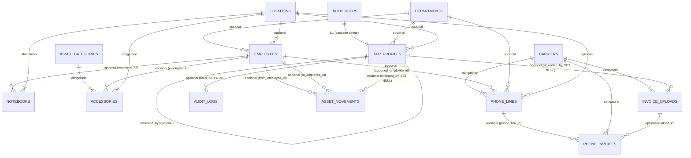

# Mapeamento do banco de dados e relacionamentos

Este documento complementa [banco-de-dados.md](banco-de-dados.md) (que descreve cada
tabela e a RLS) com o **mapa de relacionamentos**: quais tabelas se referenciam, em que
sentido, se a referência é obrigatória ou opcional, e o que acontece quando a linha
referenciada é apagada. A fonte da verdade é sempre o SQL em
[supabase/migrations/](../supabase/migrations/) — os nomes de colunas e comportamentos
abaixo foram extraídos diretamente de lá, não só resumidos de memória.

## Diagrama entidade-relacionamento

> Este bloco é um diagrama [Mermaid](https://mermaid.js.org/syntax/entityRelationshipDiagram.html).
> O GitHub renderiza Mermaid nativamente ao visualizar este arquivo `.md` no navegador —
> abra o arquivo lá para ver o diagrama desenhado. Na versão em PDF deste documento ele
> aparece como texto (o PDF é estático); use as tabelas abaixo para o mesmo conteúdo em
> formato de leitura direta.

**Convenção de leitura**: o lado com `||` é sempre "um" registro da tabela pai. No lado
"muitos", `o{` significa que a coluna de referência (FK) **aceita nulo** — nem todo
registro filho precisa apontar para um pai; `|{` significa que a FK é **`not null`** —
todo registro filho é obrigado a apontar para um pai. `AUTH_USERS` é a tabela
`auth.users`, gerenciada pelo próprio Supabase Auth (não faz parte das migrations do
projeto), incluída aqui só para mostrar de onde `app_profiles` nasce.

## Tabelas sem nenhuma FK de saída ("puras de referência")

Estas quatro tabelas só são **referenciadas**, nunca referenciam outra tabela do projeto.
São a base de cadastros compartilhados por várias entidades:

| Tabela | Referenciada por |
|---|---|
| `departments` | `employees.department_id`, `app_profiles.department_id`, `phone_lines.department_id` |
| `locations` | `employees.location_id`, `app_profiles.location_id`, `notebooks.location_id`, `accessories.location_id`, `phone_lines.location_id` |
| `asset_categories` | `accessories.category_id` |
| `carriers` | `phone_lines.carrier_id`, `phone_invoices.carrier_id`, `invoice_uploads.carrier_id` |

## Tabela completa de chaves estrangeiras (FKs)

Extraída diretamente das migrations, na ordem em que cada tabela é declarada. "Nula?"
indica se a coluna aceita `NULL` (relação opcional) — não confundir com "on delete", que é
o que acontece se a linha do **lado pai** for apagada.

| Tabela (filho) | Coluna | Referencia | Nula? | ON DELETE | Migration |
|---|---|---|---|---|---|
| `app_profiles` | `id` | `auth.users(id)` | não (é a PK) | `CASCADE` | `20260811140000` |
| `app_profiles` | `department_id` | `departments(id)` | sim | padrão (`NO ACTION`) | `20260811140000` |
| `app_profiles` | `location_id` | `locations(id)` | sim | padrão (`NO ACTION`) | `20260811140000` |
| `app_profiles` | `reviewed_by` | `app_profiles(id)` (autorreferência) | sim | `SET NULL` | `20260811140000` (criada), redefinida em `20260812150000` |
| `employees` | `department_id` | `departments(id)` | sim | padrão (`NO ACTION`) | `20260811130200` |
| `employees` | `location_id` | `locations(id)` | sim | padrão (`NO ACTION`) | `20260811130200` |
| `notebooks` | `employee_id` | `employees(id)` | sim | padrão (`NO ACTION`) | `20260811130300` |
| `notebooks` | `location_id` | `locations(id)` | **não** | padrão (`NO ACTION`) | `20260811130300` |
| `accessories` | `category_id` | `asset_categories(id)` | **não** | padrão (`NO ACTION`) | `20260811130400` |
| `accessories` | `employee_id` | `employees(id)` | sim | padrão (`NO ACTION`) | `20260811130400` |
| `accessories` | `location_id` | `locations(id)` | **não** | padrão (`NO ACTION`) | `20260811130400` |
| `phone_lines` | `carrier_id` | `carriers(id)` | **não** | padrão (`NO ACTION`) | `20260811130500` |
| `phone_lines` | `assigned_employee_id` | `employees(id)` | sim | padrão (`NO ACTION`) | `20260811130500` |
| `phone_lines` | `department_id` | `departments(id)` | sim | padrão (`NO ACTION`) | `20260811130500` |
| `phone_lines` | `location_id` | `locations(id)` | sim | padrão (`NO ACTION`) | `20260811130500` |
| `audit_logs` | `actor_user_id` | `app_profiles(id)` | sim | `SET NULL` | criada em `20260811140200`, redefinida em `20260812150000` |
| `asset_movements` | `from_employee_id` | `employees(id)` | sim | padrão (`NO ACTION`) | `20260811140200` |
| `asset_movements` | `to_employee_id` | `employees(id)` | sim | padrão (`NO ACTION`) | `20260811140200` |
| `asset_movements` | `changed_by` | `app_profiles(id)` | sim | `SET NULL` | criada em `20260811140200`, redefinida em `20260812150000` |
| `phone_invoices` | `phone_line_id` | `phone_lines(id)` | sim | padrão (`NO ACTION`) | `20260812140000` |
| `phone_invoices` | `carrier_id` | `carriers(id)` | **não** | padrão (`NO ACTION`) | `20260812140000` |
| `phone_invoices` | `upload_id` | `invoice_uploads(id)` | sim | padrão (`NO ACTION`) | `20260813120000` |
| `invoice_uploads` | `carrier_id` | `carriers(id)` | **não** | padrão (`NO ACTION`) | `20260813120000` |
| `invoice_uploads` | `uploaded_by` | `app_profiles(id)` | sim | `SET NULL` | `20260813120000` |

### Por que a maioria é `NO ACTION` e não `CASCADE`

`NO ACTION` (o padrão do Postgres quando nenhuma cláusula `ON DELETE` é escrita) significa
que o Postgres **recusa** apagar uma linha pai enquanto existir alguma linha filha
apontando para ela. Isso é proposital em quase todo o projeto: nenhuma tabela de domínio
tem exclusão física exposta via API (ver a seção de RLS em
[banco-de-dados.md](banco-de-dados.md)), então esse `NO ACTION` nunca chega a ser testado
pela aplicação normal — mas serve como uma segunda barreira de segurança caso alguém tente
apagar um departamento/localidade/categoria/operadora ainda em uso direto do SQL Editor.

### Por que só as FKs para `app_profiles` usam `SET NULL`

As três FKs que apontam para `app_profiles` (`audit_logs.actor_user_id`,
`asset_movements.changed_by`, `app_profiles.reviewed_by`, mais
`invoice_uploads.uploaded_by`) usam `ON DELETE SET NULL` por um motivo específico,
registrado no comentário da migration `20260812150000`: como o projeto ganhou uma tela de
exclusão de usuário, sem `SET NULL` a exclusão de **qualquer** ADMIN/MASTER que já tivesse
agido no sistema (aprovado alguém, editado um ativo) ficaria bloqueada pelo `NO ACTION`
padrão. Com `SET NULL`, a linha de auditoria/movimentação continua existindo — só o vínculo
com o autor específico se perde, preservando o histórico do que aconteceu mesmo que quem
fez não exista mais como usuário.

### A única relação com `CASCADE`: `app_profiles.id → auth.users.id`

É a única exclusão em cadeia de verdade do banco: apagar um usuário em `auth.users` (via
Supabase Auth, seja pelo painel ou pela Edge Function `admin-users`) apaga automaticamente
o `app_profiles` correspondente. Faz sentido aqui porque um `app_profile` não tem
existência própria sem o usuário de autenticação por trás dele.

## Relação sem FK de banco: `asset_movements`/`audit_logs` → ativos

`asset_movements.asset_id` e `audit_logs.entity_id` **não têm constraint de chave
estrangeira** — são `uuid` "soltos", com o tipo do ativo indicado pela coluna irmã
(`asset_type`/`entity_type`, um texto como `'notebook'`, `'accessory'`, `'phone_line'`).
Isso é proposital: uma FK de verdade exigiria uma constraint diferente para cada tipo de
ativo (ou uma tabela `assets` genérica, que não existe), e essas duas tabelas de histórico
precisam registrar o `id` de um ativo mesmo depois que ele deixa de existir de forma
consultável — o registro de auditoria é sobre "o que aconteceu", não uma relação que o
Postgres deva manter íntegra automaticamente. Na prática, a integridade desse vínculo é
garantida pelo próprio trigger que grava as linhas (`audit_asset_trigger`,
`audit_employee_trigger` — ver [banco-de-dados.md](banco-de-dados.md)), nunca por inserção
manual do cliente.

## Cardinalidade por entidade (visão de negócio)

| Entidade | Pode ter vários... | E pertence a (no máximo) um... |
|---|---|---|
| `departments` | colaboradores, perfis de usuário, linhas telefônicas | — |
| `locations` | colaboradores, perfis, notebooks, acessórios, linhas telefônicas | — |
| `asset_categories` | acessórios | — |
| `carriers` | linhas telefônicas, faturas, uploads de fatura | — |
| `employees` | notebooks, acessórios, linhas telefônicas atribuídas, movimentações (como origem ou destino) | departamento, localidade |
| `app_profiles` | perfis revisados por ele, logs de auditoria, movimentações registradas por ele, uploads de fatura | departamento, localidade, `auth.users` |
| `notebooks` | movimentações (via `asset_movements`, sem FK) | colaborador responsável (opcional), localidade (obrigatória) |
| `accessories` | movimentações | categoria (obrigatória), colaborador (opcional), localidade (obrigatória) |
| `phone_lines` | faturas | operadora (obrigatória), colaborador (opcional), departamento (opcional), localidade (opcional) |
| `invoice_uploads` | faturas importadas na mesma leva | operadora, usuário que enviou |
